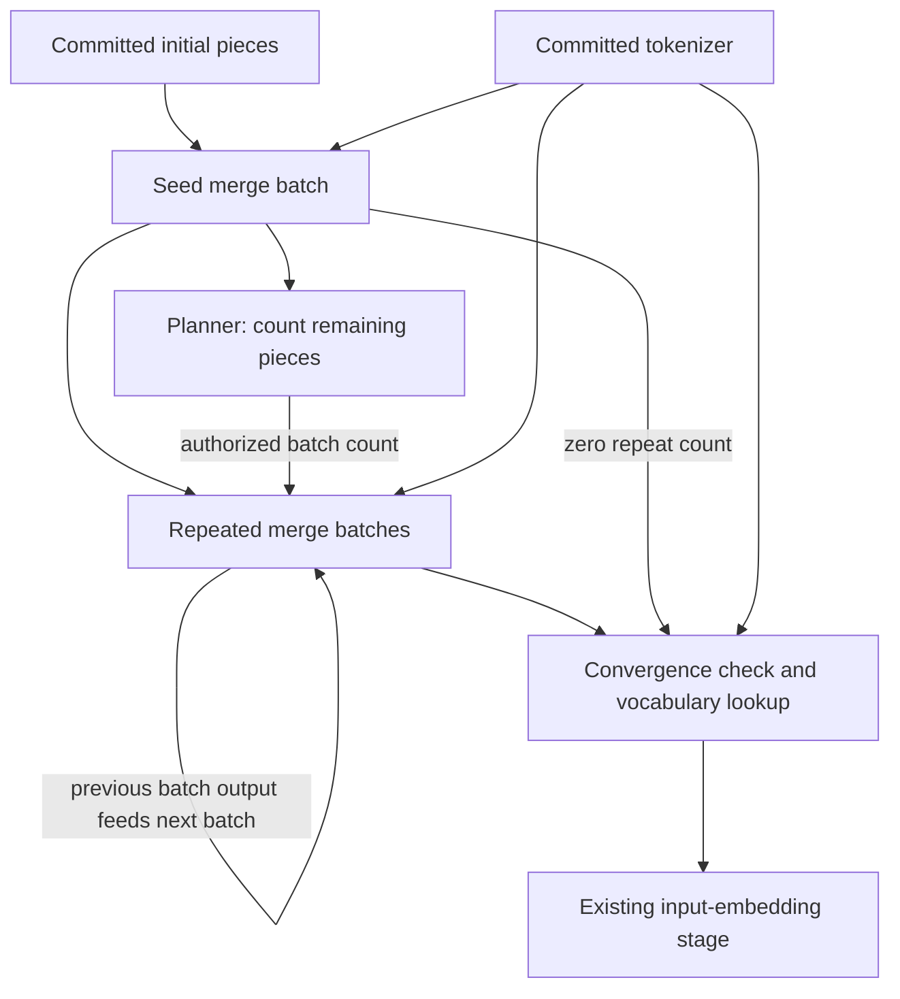

# Ranked BPE tokenization: correctness gap and proposed Raster design

Status: **Proposal for analysis; not approved for implementation.**

Date: 2026-09-08. Repository inspected at `875a6d7`.

This document records the tokenizer issue, a candidate solution using existing
Raster authoring mechanisms, and the consequences of changing the tokenizer's
stage boundaries. It does not commit to a particular decomposition or batch size.
No tokenizer, stage, manifest, or runtime implementation was changed when this
proposal was written.

## Why this needs careful treatment

The current tokenizer does not apply BPE merges in the order specified by the
model. Correcting the merge decision is necessary, but implementing it as a
verifiable Raster program is a separate engineering problem. The changing piece
list must remain accessible through authenticated storage while each tile reads
and writes a bounded amount of data.

Splitting `prompt-prepare` into multiple stages would also change chain expansion,
native stage dispatch, checkpoint boundaries, claim preparation, program identity,
and challenge replay. These changes require integration validation, including a
full Raster-chain regression run. The cost and complexity of that validation are
part of the proposal, not work to discover after modifying the tokenizer.

The candidate below provides a concrete storage handoff using existing chain
links. Its performance and overall implementation cost still need analysis.

## 1. Current behavior and the correctness gap

### What “native” means here

Native execution means this repository's Rust implementation. It does not mean
Google's reference Gemma implementation.

- Fast `infer` prepares prompt pieces and calls the shared custom tokenizer
  kernel through `DirectModel::prompt_inputs`.
- Checkpointed staged-native execution calls that same kernel through the
  `prompt_prepare` routine.
- The Raster `prompt-prepare` program implements equivalent merging with tiles
  and sequences.

Consequently, native/native parity shares implementation code, and native/Raster
parity can share an algorithmic mistake. Agreement between execution paths is
necessary but cannot establish agreement with the pretrained model's tokenizer.

Sources: [direct entry point](../../crates/inference/direct/src/model.rs),
[staged entry point](../../crates/inference/staged/src/routines/prompt_prepare.rs),
[native kernel](../../crates/inference/kernels/src/kernels/prompt_prepare.rs), and
[Raster merge sequence](../../raster-stages/prompt-prepare/src/main.rs).

### Correct tokenizer data, incorrect merge scheduling

The imported Gemma 4 tokenizer declares a BPE model with ranked merges. Its local
`tokenizer.json` SHA-256 was checked against Google's published file:
`cc8d3a0ce36466ccc1278bf987df5f71db1719b9ca6b4118264f45cb627bfe0f`.
The problem discussed here is how the program applies those rules.
[Published tokenizer](https://huggingface.co/google/gemma-4-E2B-it/blob/main/tokenizer.json).

For an illustrative piece list `[a, b, c]`, suppose the only rules are:

- Rank 0: `b + c -> bc`.
- Rank 1: `a + b -> ab`.

Ranked BPE chooses the lowest-ranked eligible adjacent pair, producing `[a, bc]`.
Our implementation encounters `a + b` first and immediately merges it, producing
`[ab, c]`. Its rank comparison only chooses among rules matching the pair
currently being examined; it does not compare competing pairs at different
positions. The reference implementation orders candidates by rank, then position.
[Reference BPE implementation](https://github.com/huggingface/tokenizers/blob/main/tokenizers/src/models/bpe/word.rs).

Both current implementations execute eight left-to-right passes and then check
that no more merges apply. Extra passes cannot undo an earlier merge. Reaching a
fixed point therefore does not establish that the correct merge order was used.

This is confirmed by source inspection and an analytical reproduction with the
real merge table. A full comparison against an installed reference tokenizer
library has **not** yet been performed. The frequency and effect of mismatches on
representative workloads have not been measured.

### Scope of reference compatibility

The current Raster entry arguments are a tokenizer table and **already prepared
pieces**, not raw prompt text. Chat formatting, special-token recognition, space
replacement, and byte fallback begin in host-side
[run preparation](../../crates/model/run-prep/src/lib.rs).

Correcting ranked merging establishes a narrower property: committed initial
pieces are merged correctly. Full Gemma compatibility also requires independent
checks of raw text and chat formatting through to exact token IDs. Tests must
compare identical rendered text first, then separately check rendering itself.
Reference mismatches in preparation, special-token boundaries, unknown-token
handling, or decoding may require additional changes beyond this proposal.

## 2. The Raster authoring challenge

Recursive tiles and recursive sequences are available. They can scan the piece
list, perform nested bucket lookups, carry small decision state, and append a new
list through a draft. Their availability is not the disputed capability.

The challenging connection is:

> Read the current list, choose a merge, build an updated list, then read that
> updated list when choosing the next merge.

The implementation must respect these distinctions:

- **Sequences route authorized references.** Arithmetic, comparisons, and merge
  decisions belong in tiles. Reads use `select!` or sanctioned recur inputs.
- **Tiles materialize selected values.** The whole tokenizer table or changing
  `List` must not become a tile argument, return value, or large carried state.
- **Drafts build outputs incrementally.** An unfinished draft is not a mutable
  read/write store for the next merge search. The next reader needs a finalized,
  selectable value.
- **Current recursive-sequence state carries a value.** Converting an `AuthRef`
  into `RecurSequenceState` materializes that value. It does not preserve a
  selectable reference to the changing collection.
- **Finalized outputs can feed later sequences or stages.** The current unrolled
  passes already use the sequence-to-sequence form of this handoff.

The adjacent Raster checkout explicitly documents the BPE feedback limitation and
permits fixed unrolling with a final convergence assertion. Its collection-carrying
state extension remains documented as proposed. These sources describe the
checkout inspected for this document; they should be rechecked before authoring:

- [Raster authoring skill](../../../raster/.claude/skills/raster/SKILL.md).
- [Recur contract and BPE limitation](../../../raster/.claude/skills/raster/references/recur.md).
- [Current state conversion and storage APIs](../../../raster/crates/raster/src/input.rs).
- [Loop-carried-state proposal](../../../raster/docs/proposals/loop-carried-state.md).

The candidate design must not introduce a synthetic list of round numbers,
untracked storage access, an unfinished-draft read, or an unbounded native tokenizer
wrapped in one tile to work around these constraints.

## 3. Candidate solution: immutable merge batches connected by the chain

The proposal introduces three logical program roles. Names below are illustrative,
not a finalized manifest or interface. The merge program runs once as a seed and
then as repeated instances.



### A. One ranked merge: search, then apply

**Search pass.** A recursive sequence walks all adjacent pairs in the current
piece list. It selects the appropriate merge bucket for each pair and invokes the
existing kind of recursive rule scan. It carries a small summary containing the
previous piece, position, and best candidate: matched flag, rank, left position,
and merged piece. Candidate ordering is lowest rank, then leftmost position.

All positions and bucket indexes used for data access must come from authenticated
inputs or tile results. Sequence bodies only bind, select, and call.

**Application pass.** A separate recur walks the same immutable input list and
builds a fresh output draft. At the selected left position it appends the merged
piece, at the right position it appends nothing, and elsewhere it copies the
piece. When no candidate exists it copies the list unchanged. The draft is then
finalized, yielding the input reference for the next operation.

Each successful operation reduces the number of real pieces by exactly one.
The next search examines the newly formed adjacent pairs. It must not reuse a
stale candidate set from an earlier list.

The existing internal `</w>` marker needs an explicit contract: validate its
placement and exclusion from merge candidates, exclude it from real-piece counts,
and remove it only at finalization. Tests must cover empty input and the last real
piece. The marker's assumptions must be audited against legitimate token content;
changing its representation would expand the input-preparation scope.

### B. A merge-batch program

A batch performs a small fixed number `B` of ranked operations through explicit
`call_seq!` sites. **Eight is an initial candidate**, chosen to preserve the
current style of unrolling, not a measured optimum.

Within the batch, each operation reads the preceding operation's finalized list.
The batch returns the final piece list through the normal program-output protocol.
The next batch reads that output through an ordinary authenticated chain binding.

The batch size is a constant pinned by the program's definition. It is not a
maximum merge count for the prompt. Once no merge remains, later operations are
identity operations; the current sequence grammar still incurs their scan/copy
work. This proposal does not assume a dynamic early exit for the entire batch.

### C. A planner and repeated batches

Run one seed batch directly on the committed initial pieces. The planner then
recursively counts the seed output's real pieces, returning a single unsigned
scalar as its whole authorized output.

For `N` real pieces after the seed batch, define:

```text
maximum_remaining_merges = max(N - 1, 0)
additional_batches = ceil(maximum_remaining_merges / B)
```

This is a sufficient upper bound, not a prediction of the actual merge count.
Every successful merge removes one real piece; operations after convergence leave
the list unchanged. Therefore the allotted batches suffice if the search and
application operations satisfy their contracts.

The planner derives its count from the actual committed piece list. A host-supplied
round-count fixture is not the correctness basis. Count arithmetic must reject
overflow. Any manifest/runtime maximum must reject an excessive count rather than
clamp it; the supported maximum still needs to be decided and tested.

Use `chain.repeat` with that stage-produced count. The first repeated batch binds
to the seed batch's output; later batches bind to the previous batch. A named
export supplies the final batch output, with the seed as its zero-count fallback.
Because a stage-produced count must be the planner's whole scalar output, the
planner is a separate role from the piece-producing seed.

Raster supports this count source and previous-stage binding pattern today.
Our staged-native executor needs corresponding support; it currently declares
`RepeatSpec.count` as `u32` and expands the chain before execution.
[Upstream repeat design](../../../raster/docs/proposals/chain-repeat.md),
[worked dynamic chain](../../../raster/examples/chain-example/Raster-dynamic.toml),
[local chain runner](../../crates/inference/staged/src/chain_runner.rs).

### D. Final token lookup

The final tokenizer role scans for remaining eligible merges and fails if any
exist. It removes the internal marker and resolves the remaining pieces through
the vocabulary lookup. The intended final output stays:

```text
PromptTokenization { token_ids: List<u32> }
```

Keeping that structural interface allows embedding to consume the result without
an algorithm change. The producer binding and program identities still change,
and corrected token IDs can change every downstream activation and generated token.

### “Batched” does not mean independently tokenized text chunks

This proposal batches **merge operations**. It does not split arbitrary text into
independent chunks and tokenize each chunk separately. Such a split can prevent
valid merges across chunk boundaries. Any alternative based on text chunking must
demonstrate that its boundaries match the exact tokenizer's segmentation rules or
provide a correct boundary-reconciliation algorithm.

## 4. Integration impact beyond the merge code

The earlier conversational estimate of three source files described a bounded
rewrite of one stage. It is not an estimate for this complete chain-based design.
The likely change areas are:

1. **Raster programs and interfaces.** Split/reorganize the current merge and
   vocabulary work; introduce the merge-batch and planner roles; define compatible
   piece-list boundaries; rebuild each affected program identity. The exact
   allocation of roles to directories and the final stage name remain open.
2. **Native kernels and stage dispatch.** Fast native inference needs ranked
   tokenization. Staged-native execution additionally needs the seed, planner,
   repeated batch, and finalization boundaries, output serialization, cache types,
   and stage-name recognition needed to reproduce Raster checkpoints.
   [Stage registry and dispatch](../../crates/inference/staged/src/routines/mod.rs).
3. **Dynamic chain expansion.** Add or reuse the upstream semantics for verified
   stage-produced counts, delayed expansion, zero-count exports, limits, and
   addressable repeated stages. Changing the count parser alone is insufficient:
   the planner must execute before the remaining stage list is known.
4. **Model import and run-manifest rendering.** Generate the new topology, keep
   tokenizer externals consistently bound, and place the frozen initial pieces at
   the seed entry. Input schemas duplicated in the importer must stay compatible.
   [Importer](../../crates/model/import/src/main.rs),
   [external schemas](../../crates/model/import/src/externals.rs).
5. **Claims, challenges, and replay.** New boundaries change checkpoint counts,
   indices, stage names, and manifest hashes. Verify that a planner/count mismatch
   is handled before divergent expansion, and that an individual repeated batch
   can be replayed with the correct prior artifacts. Preserve frozen-run semantics;
   do not reinterpret an old claim as a run of the new topology.
6. **Generated artifacts and provenance.** Deliberately regenerate affected
   `Raster.lock` files and model-specific templates/provenance. Existing serialized
   vocabulary and merge tables may remain reusable if their schemas are unchanged.
   Old execution/checkpoint artifacts are not regression oracles for corrected
   tokenization.

### A concrete manifest-rendering hazard

`render_run_manifest` currently sets `in_decode_repeat = true` whenever it sees
**any** `[[chain.repeat]]`, then replaces the next `count =` with the requested
generation-token count. Adding a tokenizer repeat without fixing this behavior
would overwrite the tokenizer's repetition count as well. Its prompt binding
logic also assumes a single `inputs.initial_pieces` placeholder.

The renderer must identify the intended decode block and preserve tokenizer
repetition semantics. Tests must include multiple repeat blocks, different decode
counts, and zero additional tokenizer batches.
[Current renderer](../../crates/inference/cli/src/claim.rs).

## 5. Performance and unresolved design choices

The straightforward search/application algorithm has quadratic worst-case work in
the number of initial pieces: each merge searches and rewrites a list that may
shrink by only one piece. Each rewrite also produces new authenticated storage.

Batching amortizes stage overhead but does not remove the repeated scans or
storage writes. The sufficient `N - 1` bound can schedule many identity operations
when the actual output contains many unmergeable tokens. There is no assumed
chain-level “stop when converged” facility in this design.

Measure tokenizer wall time, storage bytes, trace size, number of stage instances,
and representative tile/window replay cost. Include article-sized prompts and
larger supported inputs. No timing estimate or practical long-prompt performance
claim has been established.

Decisions needed before implementation:

- Is adding tokenizer stage boundaries preferable to retaining one stage with an
  explicit supported bound, or investing in upstream collection-carrying state?
- What supported prompt limits and chain-count limits are acceptable? A bound in
  initial pieces is different from the model's final-token context limit.
- What batch size gives an acceptable balance of stage overhead and stage replay
  scope? Should the planner cheaply detect convergence to avoid an unnecessary
  repeat block?
- Can the local runner reuse upstream expansion logic instead of maintaining a
  second implementation of the count and export semantics?
- What reference-preparation mismatches must be fixed alongside ranked merging?
- What changes are needed to existing claim/challenge artifact compatibility and
  repeated-stage lookup?

These are analysis questions, not reasons to bypass the authoring model. No Raster
core storage change is assumed by the candidate design, but its full integration
has not been prototyped or verified.

## 6. Validation plan and the cost of full-chain regression

A stage split needs eventual full-chain validation. It does not require running
every transformer stage for every edit to a merge tile. Establish small, reusable
validation fixtures before changing the production topology, then widen coverage
when the preceding level is stable.

### 1. Independent tokenizer expectations

Pin the tokenizer artifact and reference-library version. Compare exact token IDs
for the same rendered text. Include competing ranks, overlapping equal-rank
occurrences, newly exposed candidates, no-merge cases, empty input, final-piece
handling, Unicode, byte fallback, whitespace, special tokens, and article text.
Check the host-preparation path separately from the merge algorithm.

For a mismatch case, corrected outputs are expected to differ from the old
implementation. “Did inference break?” must therefore distinguish intended
token-ID corrections from new execution or wiring errors.

### 2. Isolated merge and batch checks

Use tiny committed fixtures to check one operation and multiple batches. Verify
the winner's rank/position, exact output pieces, one-piece reduction per successful
merge, identity after convergence, and final rejection when a merge remains.
Exercise completion immediately before, at, and after a batch boundary.

These fixtures should run the actual authored sequence, not only a Rust function
that resembles it. Standard and no-std compilation are necessary, followed by CFS
inspection, RISC0 guest build, authenticated execution, and commit/audit round-trips.

### 3. A tokenizer-only chain fixture

Create a small integration harness for the seed, planner, repeat, and finalization
roles. This harness is proposed work; it does not exist as a completed facility.
It should exercise zero-count exports, several batches, count limits, native/Raster
artifact parity at each boundary, and an incorrect claimed planner or batch result.

Verify that each consumer is bound to the correct producer and that a selected
middle batch can be replayed with its recorded committed inputs. Native-only and
`--no-auth` runs help iteration but do not replace authenticated audit evidence.

### 4. Inference and challenge integration

Test model import, run-manifest rendering, staged-native expansion, final tokenizer
output binding to embedding, and claim/challenge operation on the new stage types.
Compare fast-native and staged-native token IDs and inference results using the
corrected tokenizer. Exercise frozen prompt/generation-count behavior.

The current challenge workflow already recomputes natively and replays only the
first divergent stage through `cargo raster chain run --stage <stage>`. That is
useful for focused checks once the necessary prior artifacts exist; it is not a
replacement for testing the new chain topology or a free replay with no setup.
[Challenge workflow](../workflows/challenge-build.md).

### 5. Full Raster-chain regression

After the smaller checks pass, run the full Raster inference chain with the new
topology and perform the applicable execution audit and native/Raster comparisons.
Include a prompt known to differ under the old merge algorithm, a compatibility
case, and a representative longer prompt as resources permit. Record the model,
tokenizer, program identities, manifest, inputs, and exact commands with results.

This is the expensive integration gate identified in the discussion. It must be
budgeted into the work. Reusing old downstream results after prompt token IDs have
changed would not validate the new execution.

Follow the repository's [development checks](../internals/development.md) and the
Raster authoring skill's check ladder. Build success and value parity alone do not
establish correct authoring or verifiability.

## 7. Proposed next step

Review the stage decomposition, storage lifecycle, count derivation, runner and
manifest impact, and validation cost in this document. Select the intended design
and supported scope before editing the production Raster stage. If the chain-based
candidate is selected, establish the independent reference fixtures and isolated
tokenizer-chain harness before migrating the full inference chain.
